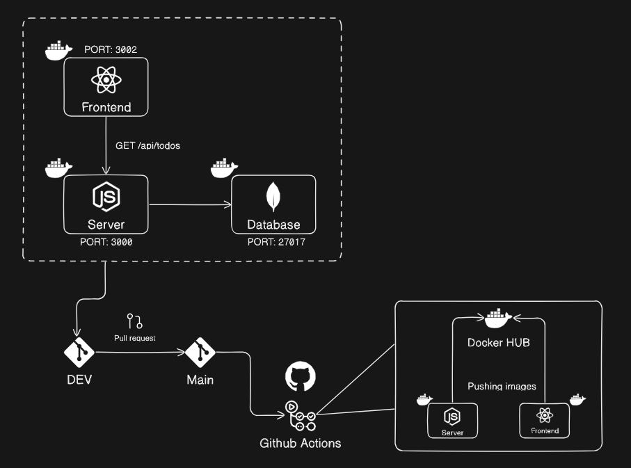

# Docker TODO app with Node JS, React and MongoDB.

[](https://github.com/Amine-Alami/Ci-CD-H3/actions/workflows/frontend-ci.yml) [](https://github.com/Amine-Alami/Ci-CD-H3/actions/workflows/server-ci.yml) [](https://github.com/Amine-Alami/Ci-CD-H3/actions/workflows/compose-ci.yml)


## Overview

This project is part of a CI/CD course

In this repo we define two **Docker** containers : **frontend** and **backend**. Our frontend is on **ReactJS** and our **backend** is on **NodeJS**, which connects to a **MongoDB** database.

## App architecture



## GuideLine Steps

We used two DockerFiles one for frontend and other for backend. 
First we will get through the `Dockerfile` of frontend and backend then `docker-compose file`.

#### 2. Snippet of backend (Node.js) `DockerFile`

You will find this `DockerFile` file in the root directory of the project.

```bash
FROM node:10

#Argument that is passed from docer-compose.yml file
ARG NODE_PORT

#Echo the argument to check passed argument loaded here correctly
RUN echo "Argument port is : $NODE_PORT"

# Create app directory
WORKDIR /usr/src/app

#COPY . .
COPY . .

# Install app dependencies
RUN npm install


EXPOSE ${NODE_PORT}

CMD npm run dev
```


#### 3. Snippet of frontend (ReactJS) `DockerFile`

You will find this `DockerFile` inside **frontend** directory. 

```bash
# Create image based on the official Node image from dockerhub
FROM node:10

#Argument that is passed from docer-compose.yaml file
ARG FRONT_END_PORT

# Create app directory
WORKDIR /usr/src/app

#Echo the argument to check passed argument loaded here correctly
RUN echo "Argument port is : $FRONT_END_PORT"

# Copy dependency definitions
COPY package.json /usr/src/app

# Install dependecies
RUN npm install

# Get all the code needed to run the app
COPY . /usr/src/app

# Expose the port the app runs in
EXPOSE ${FRONT_END_PORT}

# Serve the app
CMD ["npm", "start"]
```


#### 4. Snippet of `docker-compose`

```bash
version: "2"
services:
  frontend:
    build:
      context: frontend
      args:
        FRONT_END_PORT: ${FRONT_END_PORT}
    ports:
      - ${FRONT_END_PORT}:${FRONT_END_PORT}
    volumes:
      - ./frontend:/usr/src/app
    container_name: front-container
    restart: always
  app:
    container_name: app
    restart: always
    build:
      context: .
      args:
        NODE_PORT: ${NODE_PORT}
    ports:
      - ${NODE_PORT}:${NODE_PORT}
    volumes:
      - .:/usr/src/app
```


#### 5. Command to Build and Run the Docker images/containers localy

We can now navigate to the project directory, open up a terminal window and run :

```bash
$ docker-compose up
```


As we can see in the logs, the cosmos db is connected


#### 6. Verification of Server is running

Use postman or curl to test the api.

```bash
$  curl http://localhost:3000/api
```

If everything works fine you will get the response 

`{"code":200,"success":true,"message":"Successfully completed","todos":[]}`


#### 7. Verification of FrontEnd

Open your favourite browser and go to 

###### :clipboard: `Note: It is the port which I defined in `.env` file you can change this port it's totally up to you.`

```
http://localhost:3002/
```


You will see something like this


